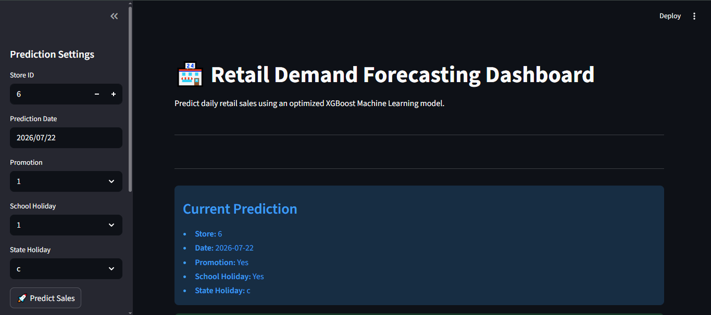
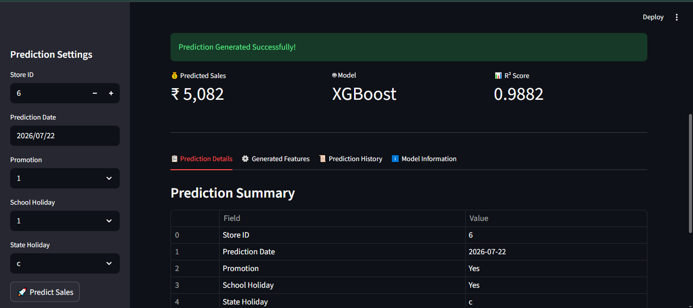
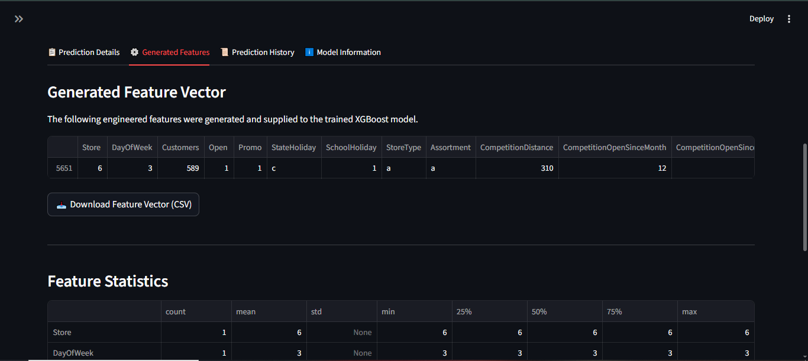
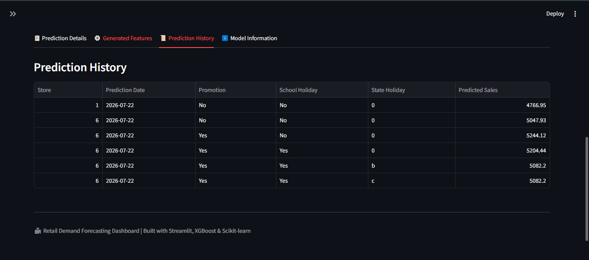
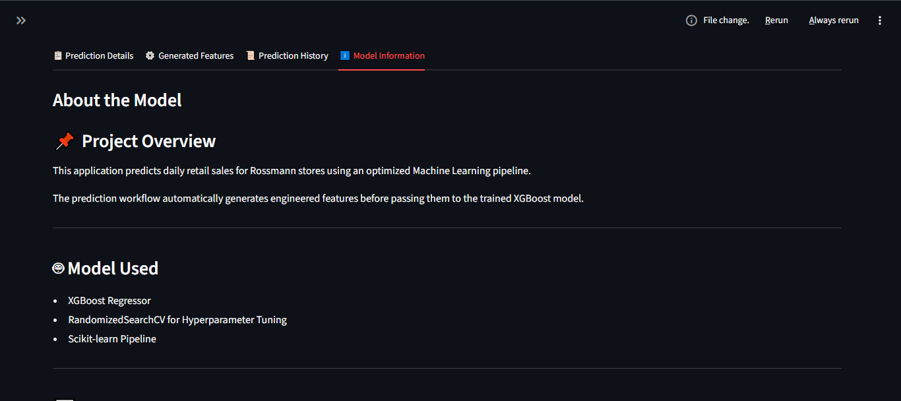
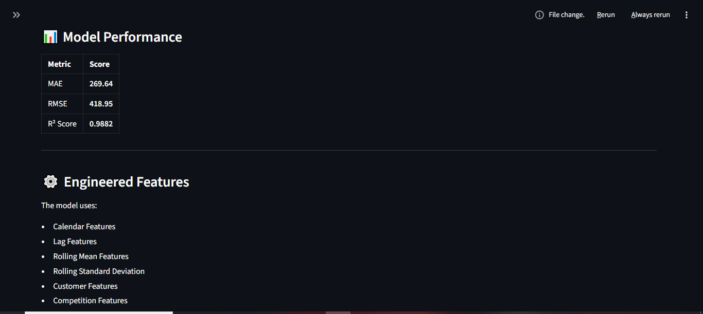
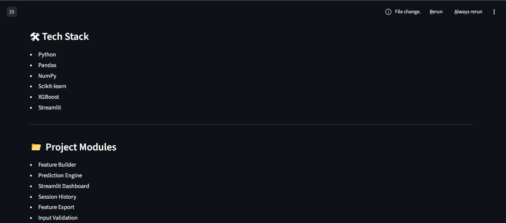

# 📈 Retail Demand Forecasting Dashboard

An end-to-end Machine Learning project that predicts daily retail sales for Rossmann stores using an optimized **XGBoost Regressor**. The project includes data preprocessing, feature engineering, model training, hyperparameter tuning, and deployment through an interactive **Streamlit** dashboard.

---

## 🚀 Project Overview

Retail demand forecasting is essential for inventory planning, workforce management, and business decision-making. This project leverages historical Rossmann Store Sales data to build a high-performance regression model capable of accurately predicting future daily sales.

The application allows users to:
- Select a store
- Choose a prediction date
- Configure promotion and holiday information
- Generate sales predictions instantly
- View engineered features used for prediction
- Download the generated feature vector
- Track prediction history within the session

---

## 📂 Project Structure

```
Retail-Demand-Forecasting-Analytics/
│
├── app.py
├── requirements.txt
├── README.md
│
├── models/
│   └── tuned_model.pkl
│
├── utils/
│   ├── predictor.py
│   └── feature_builder.py
│
├── data/
│   └── processed/
│       └── featured_data.csv
│
├── notebooks/
│   ├── EDA.ipynb
│   ├── Feature_Engineering.ipynb
│   └── Model_Training.ipynb
│
└── screenshots/
```

---

# 📊 Dataset

**Dataset:** Rossmann Store Sales

The dataset contains historical information about:

- Store Information
- Daily Sales
- Customer Count
- Promotions
- School Holidays
- State Holidays
- Competition Details
- Store Assortment
- Store Type

---

# ⚙️ Machine Learning Workflow

The project follows an end-to-end Machine Learning pipeline:

### 1. Data Cleaning

- Missing value treatment
- Data type conversion
- Duplicate removal
- Feature preprocessing

---

### 2. Exploratory Data Analysis (EDA)

Performed extensive analysis including:

- Sales Distribution
- Correlation Analysis
- Store-wise Sales
- Promotion Impact
- Holiday Analysis
- Customer Trends
- Time Series Visualization

---

### 3. Feature Engineering

Created predictive features including:

### Calendar Features

- Year
- Month
- Quarter
- Week of Year
- Day
- Day of Week
- Day of Year
- Month Start
- Month End
- Weekend Indicator

### Lag Features

- Previous Day Sales
- 7-Day Sales Lag
- 14-Day Sales Lag

### Rolling Statistics

- 7-Day Rolling Mean
- 30-Day Rolling Mean
- 7-Day Rolling Standard Deviation

### Customer Features

- Previous Customer Count
- Rolling Customer Average
- Average Customers per Store

### Business Features

- Competition Distance
- Competition Age
- Promotion Status
- Store Type
- Assortment

### Cyclical Encoding

- Month Sin
- Month Cos
- Weekday Sin
- Weekday Cos

---

# 🤖 Models Evaluated

The following regression models were trained and compared:

| Model | MAE | RMSE | R² Score |
|------|------:|------:|------:|
| Linear Regression | 573.45 | 823.82 | 0.9546 |
| Decision Tree | 464.63 | 736.25 | 0.9637 |
| Gradient Boosting | 489.83 | 727.47 | 0.9646 |
| Random Forest | 297.16 | 476.88 | 0.9848 |
| XGBoost | 285.44 | 441.67 | 0.9869 |

---

# 🏆 Final Model

After hyperparameter tuning using **RandomizedSearchCV**, the optimized XGBoost model achieved:

| Metric | Value |
|--------|--------:|
| MAE | **269.64** |
| RMSE | **418.95** |
| R² Score | **0.9882** |

The model explains approximately **98.8% of the variance** in daily retail sales.

---
##Deployment screenshots
```







```

# 💻 Streamlit Dashboard Features

The deployed application provides:

- Interactive prediction interface
- Store selection
- Date-based forecasting
- Promotion & holiday configuration
- Real-time sales prediction
- KPI cards
- Prediction summary
- Generated feature vector
- Download feature vector as CSV
- Feature statistics
- Prediction history
- Model information page
- Input validation
- Error handling

---

# 🛠 Tech Stack

### Programming Language

- Python

### Data Processing

- Pandas
- NumPy

### Machine Learning

- Scikit-learn
- XGBoost

### Model Serialization

- Joblib

### Deployment

- Streamlit

---

---

# 📦 Installation

Clone the repository:

```bash
git clone https://github.com/yourusername/Retail-Demand-Forecasting-Analytics.git
```

Move into the project directory:

```bash
cd Retail-Demand-Forecasting-Analytics
```

Install dependencies:

```bash
pip install -r requirements.txt
```

Run the application:

```bash
streamlit run app.py
```

---

# 📈 Sample Workflow

1. Select Store ID
2. Choose Prediction Date
3. Select Promotion Status
4. Select School Holiday
5. Select State Holiday
6. Click **Predict Sales**
7. View predicted sales
8. Inspect generated features
9. Download feature vector if required

---

# 📌 Future Improvements

Potential enhancements include:

- SHAP Explainability
- Batch Predictions
- Multi-store Forecasting
- Interactive Visualizations
- Model Monitoring
- Cloud Deployment
- REST API Integration
- Automated Retraining Pipeline

---

# 👨‍💻 Author

**Mahipal Singh Rajput**

GitHub: https://github.com/Codespydii


---

## ⭐ If you found this project useful, consider giving it a star on GitHub!
